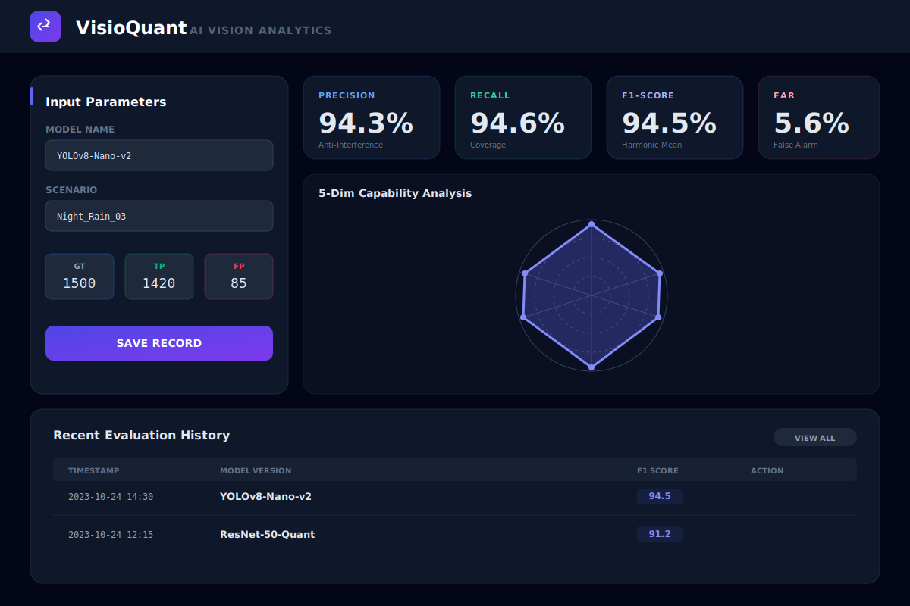

# VisioQuant Analytics 🧠📊

**VisioQuant** 是一款面向 AI 计算机视觉工程师的工业级算法效能评估工具。该系统基于 **Core Logic Manifesto (核心逻辑宣言)** 构建，强调从模型预测总数 (Total Predictions) 出发，通过与真值 (Ground Truth) 的对撞，多维度量化模型在实际生产环境中的表现。

## 🖼️ 系统预览

---

## 📐 核心量化逻辑 (Core Logic Manifesto)

系统强制要求建立在以下三个物理观测值之上，杜绝模糊输入：

1.  **AI 总数 (Pred Total)**: 模型在画面中产生的所有预测框总数。这是衡量模型“纯净度”与“冗余度”的关键基石。
2.  **真值总数 (GT)**: 场景中实际存在的目标物理总数。
3.  **有效命中 (TP)**: 经由 IOU 校验确认为正确的预测框数量。

### 自动化指标推导：
-   **误报数 (FP)** = AI 总数 - 有效命中 (衡量“废话”多少)
-   **漏报数 (FN)** = 真值总数 - 有效命中 (衡量“遗漏”多少)
-   **精确率 (Precision)** = TP / AI 总数 (抗干扰能力)
-   **召回率 (Recall)** = TP / GT (目标覆盖能力)
-   **F1-Score**: 精确率与召回率的调和平均值。

---

## ✨ 核心特性

-   **🚀 AI 总数优先布局**: UI 遵循“模型产出 -> 现实对撞”的思维顺序，突出 AI Count 在评估中的核心地位。
-   **📏 空间维度评估 (Spatial Mode)**: 支持按 COCO 标准（Small, Medium, Large）录入真值分布，自动聚合 GT 总数。
-   **📊 五维能力画像**: 实时生成雷达图，涵盖精确度、召回力、综合 F1、抗噪性及效能比五个维度。
-   **📈 性能演进追踪**: 自动绘制版本更迭趋势图，直观监测模型调优效果。
-   **🔒 隐私第一 (Local-first)**: 100% 本地化存储，数据永不出库，确保核心算法指标的绝对安全。
-   **📥 报表导出**: 支持中英双语切换，导出的 CSV 文件自动对齐表头，并将核心指标格式化为**百分比数值**。

---

## 🛠️ 技术实现

-   **Frontend**: React 19, Tailwind CSS
-   **Visualization**: Recharts (Radar & Line charts)
-   **Storage**: Browser LocalStorage / IndexedDB (via Service Layer)
-   **Icons**: Lucide React

---

## 📖 使用说明

1.  **基础信息**: 输入模型版本、置信度及测试场景。
2.  **数值录入**: 
    -   填入 **AI 总数** (Pred Total)。
    -   选择数量模式或空间模式填入 **GT**。
    -   填入 **TP** 命中数。
3.  **保存与对比**: 点击保存，系统将记录快照。可在“数据资产”页面导出 CSV 报表进行线下汇报。

---

## 📄 许可证

本项目基于 MIT 许可证开源。